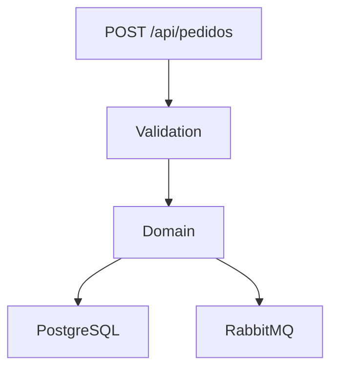

# 📦 Pedido Processamento Service  
> **teste-pedido-processing-service**

Microserviço de **processamento de pedidos** desenvolvido em **ASP.NET Core**, seguindo princípios de **Clean Architecture**, com persistência em **PostgreSQL**, mensageria via **RabbitMQ** e **Entity Framework Core**.

---

## ✨ Visão geral

- API REST para criação de pedidos  
- Persistência com EF Core + PostgreSQL  
- Publicação de eventos via RabbitMQ  
- Arquitetura limpa e organizada 

---

## 🏗️ Arquitetura

```
src/
 ├── PedidosProcessamento.WebApi          → API / Startup
 ├── PedidosProcessamento.Application     → Casos de uso, DTOs, Validators
 ├── PedidosProcessamento.Domain          → Entidades e regras de domínio
 └── PedidosProcessamento.Infrastructure → EF Core, Repositórios, RabbitMQ
tests/
 └── PedidosProcessamento.Application.Tests
     ├── Services
     │   └── CriarPedidoServiceTests.cs
     └── Validators
         └── CriarPedidoRequestValidatorTests.cs
```

---

## 🚀 Tecnologias

| Tecnologia | Uso |
|-----------|-----|
| .NET 10 | Plataforma |
| ASP.NET Core | Web API |
| Entity Framework Core | ORM |
| PostgreSQL | Banco de dados |
| RabbitMQ | Mensageria |
| Docker & Docker Compose | Infra local |
| FluentValidation | Validação |
| Swagger | Documentação da API |
| xUnit | Framework de testes | 
| Moq | Mock de dependências | 
| FluentAssertions | Asserções mais legíveis | 
---

## 📋 Pré-requisitos

- .NET SDK 10  
- Docker Desktop  
- EF Core CLI  

```bash
dotnet tool install --global dotnet-ef
```

---

## ⚙️ Configuração

### appsettings.json

```json
{
  "ConnectionStrings": {
    "DefaultConnection": "Host=localhost;Port=5432;Database=postgres;Username=postgres;Password=postgres"
  },
  "RabbitMQ": {
    "Host": "localhost",
    "Port": 5672,
    "Username": "guest",
    "Password": "guest"
  }
}
```

---

## 🐳 Docker

```bash
docker compose up -d
```

RabbitMQ UI: http://localhost:15672  
Usuário: guest / Senha: guest

---

## 🗄️ Migrations

```bash
dotnet ef migrations add InitialCreate   --project src/PedidosProcessamento.Infrastructure   --startup-project src/PedidosProcessamento.WebApi
ou
Add-Migration InitialCreate
```

```bash
dotnet ef database update   --project src/PedidosProcessamento.Infrastructure   --startup-project src/PedidosProcessamento.WebApi
ou
Update-Database
```

---

## ▶️ Executando

```bash
dotnet run --project src/PedidosProcessamento.WebApi
```

Swagger:

```
https://localhost:7xxx/swagger
```

---

## 📬 RabbitMQ

Evento publicado na fila:

```
pedido-criado
```

---

▶️ Executando os testes

Na raiz do projeto:

```bash
dotnet test
```

Ou somente o projeto de testes:

```bash
dotnet test tests/PedidosProcessamento.Application.Tests

```

---

## 🧪 Fluxo



---

## 🛠️ Comandos úteis

```bash
dotnet ef migrations list
dotnet ef migrations remove
```

---

📝 Decisões técnicas

- RabbitMQ real para publicação de eventos de pedidos, garantindo desacoplamento entre microserviços.
- Result Pattern aplicado nos casos de uso para tratamento explícito de sucesso e falhas, evitando exceptions como fluxo normal.
- FluentValidation para validação dos requests, mantendo a API robusta e fácil de extender.
  
---

💡 Melhorias futuras

Se tivéssemos mais tempo, seria interessante:

-Implementar testes funcionais e de integração, além dos testes unitários já existentes.
-Adotar Unit of Work para organizar transações e persistência em múltiplos repositórios.
-Utilizar Dapper para queries mais complexas ou de alta performance, mantendo EF Core para operações CRUD simples.
