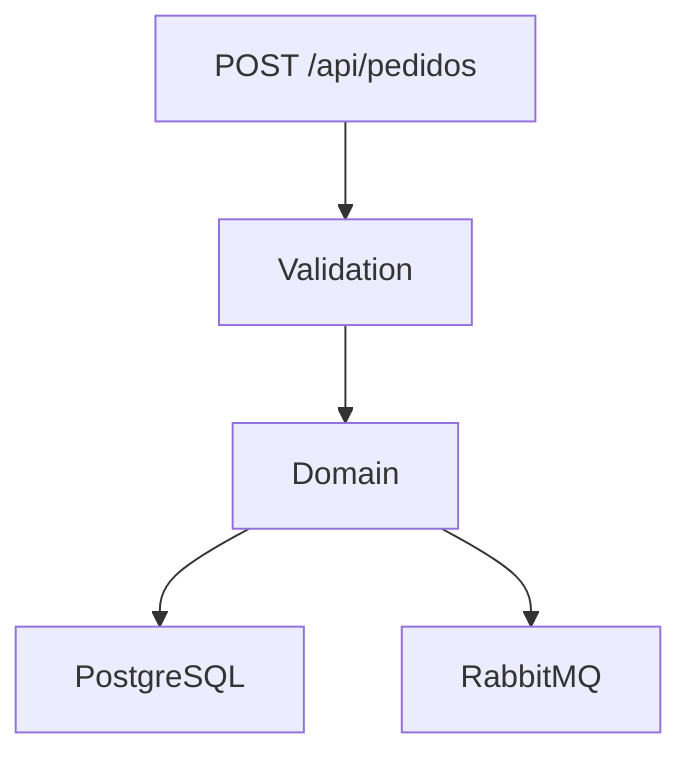

# 📦 Pedido Processing Service  
> **teste-pedido-processing-service**

Microserviço de **processamento de pedidos** desenvolvido em **ASP.NET Core**, seguindo princípios de **Clean Architecture**, com persistência em **PostgreSQL**, mensageria via **RabbitMQ** e **Entity Framework Core**.

---

## ✨ Visão geral

- API REST para criação de pedidos  
- Persistência com EF Core + PostgreSQL  
- Publicação de eventos via RabbitMQ  
- Arquitetura limpa e organizada  
- Ideal como **teste técnico** ou **base de microserviço**

---

## 🏗️ Arquitetura

```
src/
 ├── PedidosProcessamento.WebApi          → API / Startup
 ├── PedidosProcessamento.Application     → Casos de uso, DTOs, Validators
 ├── PedidosProcessamento.Domain          → Entidades e regras de domínio
 └── PedidosProcessamento.Infrastructure → EF Core, Repositórios, RabbitMQ
```

---

## 🚀 Tecnologias

| Tecnologia | Uso |
|-----------|-----|
| .NET 10 | Plataforma |
| ASP.NET Core | Web API |
| Entity Framework Core | ORM |
| PostgreSQL | Banco de dados |
| RabbitMQ | Mensageria |
| Docker & Docker Compose | Infra local |
| FluentValidation | Validação |
| Swagger | Documentação da API |

---

## 📋 Pré-requisitos

- .NET SDK 10  
- Docker Desktop  
- EF Core CLI  

```bash
dotnet tool install --global dotnet-ef
```

---

## ⚙️ Configuração

### appsettings.json

```json
{
  "ConnectionStrings": {
    "DefaultConnection": "Host=localhost;Port=5432;Database=pedidos;Username=postgres;Password=postgres"
  },
  "RabbitMQ": {
    "Host": "localhost",
    "Port": 5672,
    "Username": "guest",
    "Password": "guest"
  }
}
```

---

## 🐳 Docker

```bash
docker compose up -d
```

RabbitMQ UI: http://localhost:15672  
Usuário: guest / Senha: guest

---

## 🗄️ Migrations

```bash
dotnet ef migrations add InitialCreate   --project src/PedidosProcessamento.Infrastructure   --startup-project src/PedidosProcessamento.WebApi
```

```bash
dotnet ef database update   --project src/PedidosProcessamento.Infrastructure   --startup-project src/PedidosProcessamento.WebApi
```

---

## ▶️ Executando

```bash
dotnet run --project src/PedidosProcessamento.WebApi
```

Swagger:

```
https://localhost:7xxx/swagger
```

---

## 📬 RabbitMQ

Evento publicado na fila:

```
pedido-criado
```

---

## 🧪 Fluxo



---

## 🛠️ Comandos úteis

```bash
dotnet ef migrations list
dotnet ef migrations remove
```
